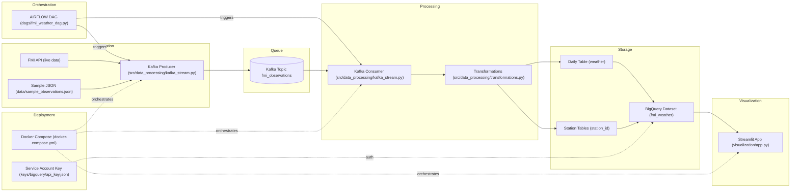

# FMI Weather Data Pipeline

This repository demonstrates an ELT pipeline for ingesting Finnish Meteorological Institute (FMI) observations and preparing daily and long-term tables for downstream analytics and visualisation.

The pipeline uses a Kafka producer/consumer pair to capture raw observations, stores them in BigQuery, and relies on Airflow orchestration. A Streamlit app is included to showcase the latest and long-term views with bundled offline sample data.

## Contents
- `src/data_processing/`: Python modules for FMI access, Kafka streaming, and transformations.
- `dags/`: Airflow DAG that chains producer and consumer tasks.
- `visualization/`: Streamlit demo UI.
- `data/sample_observations.json`: Sample observations for offline testing.

## Data model and DAG plan
1. **Ingestion**: `ObservationProducer` (`src/data_processing/kafka_stream.py`) calls `FMIClient.fetch_latest()` to pull the most recent observations and publish them to Kafka.
2. **Landing in BigQuery**: `ObservationConsumer` reads Kafka messages in batches and appends them to `fmiweatherdatapipeline.fmi_weather.weather` (project, dataset, and table configurable via environment variables).
3. **Daily processing**: 
   - Dedupe incoming rows on `(station_id, timestamp)`.
   - Run lightweight quality checks for missing values and outliers (functions in `transformations.py`).
   - Persist deduped daily data.
4. **Long-term history**: After each batch load, append records for selected stations into individual `station_<id>` tables for easier time-series access.
5. **Orchestration**: `dags/fmi_weather_dag.py` schedules ingestion every 15 minutes with basic retry settings.
6. **Visualisation**: `visualization/app.py` renders latest tables and long-term series (temperature and humidity) via Streamlit.

## ETL/ELT architecture at a glance



## Running locally

### Prerequisites
- Python 3.10+
- Kafka broker available at `localhost:9092` (configurable via env var `KAFKA_BOOTSTRAP_SERVERS`)
- Google Cloud credentials for BigQuery (if testing actual loads)

Install dependencies (UI, producer, and consumer services):
```bash
python -m venv .venv
source .venv/bin/activate
pip install -r requirements-streamlit.txt
```

If you want to develop Airflow DAGs locally, install its dependencies separately to keep the heavier stack isolated from the Streamlit image:
```bash
pip install -r requirements-airflow.txt
```

Place your BigQuery API key or service account JSON file at `keys/bigquery/api_key.json`
or point `BIGQUERY_API_KEY_PATH` to its location so the pipeline can authenticate
to the `fmiweatherdatapipeline` project.

### Environment configuration
Key environment variables:
- `FMI_API_KEY`: FMI API key (optional for demo when `USE_SAMPLE_DATA=true`).
- `USE_SAMPLE_DATA`: Set to `true` to use bundled sample observations instead of live FMI API calls.
- `KAFKA_BOOTSTRAP_SERVERS`: Kafka bootstrap servers (default `localhost:9092`).
- `KAFKA_TOPIC`: Kafka topic for observations (default `fmi_observations`).
- `BIGQUERY_PROJECT`: BigQuery project ID (default `fmiweatherdatapipeline`).
- `BIGQUERY_DATASET`: Dataset where tables are stored (default `fmi_weather`).
- `BIGQUERY_DAILY_TABLE`: Table for daily loads (default `weather`).
- `BIGQUERY_API_KEY_PATH`: Path to the BigQuery API key or service account JSON file (default `keys/bigquery/api_key.json`).
- `STATION_WHITELIST`: Comma-separated list of station IDs that should receive long-term tables (default includes five Finnish stations).

### Producing and consuming observations
Run the producer once to send observations into Kafka:
```bash
USE_SAMPLE_DATA=true python -m src.data_processing.kafka_stream produce
```

Consume a batch and upload to BigQuery:
```bash
USE_SAMPLE_DATA=true python -m src.data_processing.kafka_stream consume --max-messages 200
```

### Airflow
Copy `dags/fmi_weather_dag.py` into your Airflow `dags/` folder. Set environment variables in Airflow for Kafka and BigQuery connectivity. The DAG schedules producer then consumer every 15 minutes.

### Streamlit demo
The demo uses sample data by default.
```bash
USE_SAMPLE_DATA=true streamlit run visualization/app.py
```

### Running with Docker

The repository includes a Docker Compose setup that starts Kafka, creates the
`fmi_observations` topic, and launches producer, consumer, and Streamlit
containers. Each service now builds against the requirements file that matches
its role (worker vs. Streamlit) to avoid Airflow dependencies in the UI image.

1. Build images and start the stack:
   ```bash
   docker compose up --build
   ```
2. Access the Streamlit demo at http://localhost:8501.

Environment notes:
- The compose file sets `USE_SAMPLE_DATA=true` for the producer so it can run
  without FMI API access.
- For BigQuery loads, mount your service account key at
 `./keys/bigquery/api_key.json` (the container expects it at
  `/app/keys/bigquery/api_key.json`).

### Stopping the services
- Stop locally started Python commands (producer/consumer/Streamlit) with `Ctrl+C` in the terminal running them.
- Stop the Docker Compose stack with:
  ```bash
  docker compose down
  ```
  This cleanly halts Kafka, producer, consumer, and Streamlit containers.

## Dev Runbook (Docker Compose)

This runbook lists the exact commands to run in common situations (normal run, after code changes, and troubleshooting).

### 1) Normal usage

#### Start the full stack (build + run)
```bash
docker compose up -d --build
```

#### Check status

```bash
docker compose ps
```

#### Follow all logs

```bash
docker compose logs -f
```

---

### 2) After code changes

#### A) Changed Streamlit UI (`visualization/…`)

Rebuild and recreate only Streamlit:

```bash
docker compose up -d --build --force-recreate streamlit
```

If it still looks like old code (cache):

```bash
docker compose build --no-cache streamlit
docker compose up -d --force-recreate streamlit
```

Logs:

```bash
docker compose logs -f streamlit
```

#### B) Changed worker code (`src/…`) affecting producer/consumer

```bash
docker compose up -d --build --force-recreate producer consumer
```

Logs:

```bash
docker compose logs -f producer
docker compose logs -f consumer
```

Only consumer changed:

```bash
docker compose up -d --build --force-recreate consumer
```

#### C) Changed only `docker-compose.yml`

Usually enough:

```bash
docker compose up -d --force-recreate
```

If build args / requirements / Dockerfile also changed:

```bash
docker compose up -d --build --force-recreate
```

---

### 3) Recommended dev workflow: infra as services, jobs as one-shots

Producer/consumer are often easiest to run as one-shot jobs during development.

#### Start only infrastructure

```bash
docker compose up -d broker init-topics
```

#### Run producer once

```bash
docker compose run --rm producer
```

#### Run consumer once (example: 5 messages)

```bash
docker compose run --rm consumer python -m src.data_processing.kafka_stream consume --max-messages 5
```

---

### 4) BigQuery checks

#### Confirm the key file exists inside the container

```bash
docker compose exec -T consumer ls -l /app/keys/bigquery/api_key.json
```

#### Count rows in the daily table

```bash
docker compose exec -T consumer python - <<'PY'
import pandas_gbq
q = "SELECT COUNT(*) AS n FROM `fmiweatherdatapipeline.fmi_weather.weather`"
print(pandas_gbq.read_gbq(q, project_id="fmiweatherdatapipeline"))
PY
```

#### List tables in the dataset

```bash
docker compose exec -T consumer python - <<'PY'
import pandas_gbq
q = """
SELECT table_name
FROM `fmiweatherdatapipeline.fmi_weather.INFORMATION_SCHEMA.TABLES`
ORDER BY table_name
"""
print(pandas_gbq.read_gbq(q, project_id="fmiweatherdatapipeline"))
PY
```

---

### 5) Kafka checks

#### Read 5 messages from the topic (proof that data exists)

```bash
docker compose exec broker /opt/kafka/bin/kafka-console-consumer.sh \
  --bootstrap-server broker:29092 \
  --topic fmi_observations \
  --from-beginning \
  --max-messages 5
```

#### Check consumer group offsets / lag

```bash
docker compose exec broker /opt/kafka/bin/kafka-consumer-groups.sh \
  --bootstrap-server broker:29092 \
  --describe \
  --group fmi-ingestion
```

#### If consumer prints "No messages read…", reset offsets to earliest

1. Stop consumer:

```bash
docker compose stop consumer
```

2. Reset offsets:

```bash
docker compose exec broker /opt/kafka/bin/kafka-consumer-groups.sh \
  --bootstrap-server broker:29092 \
  --group fmi-ingestion \
  --topic fmi_observations \
  --reset-offsets --to-earliest --execute
```

3. Run consumer again (one-shot):

```bash
docker compose run --rm consumer python -m src.data_processing.kafka_stream consume --max-messages 5
```

---

### 6) Troubleshooting quick fixes

#### A) "Container name already in use"

```bash
docker rm -f broker init-topics producer consumer streamlit 2>/dev/null || true
docker compose up -d
```

#### B) Port 9092 already allocated

Check what is using 9092:

```bash
docker ps --format "table {{.Names}}\t{{.Ports}}\t{{.Status}}"
```

Stop/remove the container that binds `0.0.0.0:9092->…`.

#### C) "the input device is not a TTY" (heredoc / piping)

Use `-T`:

```bash
docker compose exec -T consumer python - <<'PY'
print("ok")
PY
```

#### D) BuildKit snapshot/layer errors (e.g., "parent snapshot does not exist")

```bash
docker builder prune -af
docker compose build --no-cache
docker compose up -d --force-recreate
```

#### E) Producer shows "Restarting (0)"

Exit code 0 means it is a one-shot job and restart policy is re-running it. Prefer running it via:

```bash
docker compose run --rm producer
```

---

### 7) Clean start (project scope)

#### Remove containers, networks, volumes and rebuild from scratch

```bash
docker compose down --remove-orphans --volumes
docker compose build --no-cache
docker compose up -d --force-recreate
```

#### Full Docker cleanup (removes unused containers/images/volumes)

```bash
docker system prune -af --volumes
```

## Testing transformations with sample data
A pytest suite exercises the transformation utilities. Run:
```bash
python -m pip install pytest
USE_SAMPLE_DATA=true pytest
```

## Notes
- Parsing of FMI XML responses is simplified by expecting GeoJSON-like input. For production use, replace `_parse_response` in `fmi_client.py` with a full WFS parser or use the official FMI Python client to generate JSON payloads.
- BigQuery interactions depend on `pandas.DataFrame.to_gbq`; ensure the `pandas-gbq` extras are installed in your environment.
